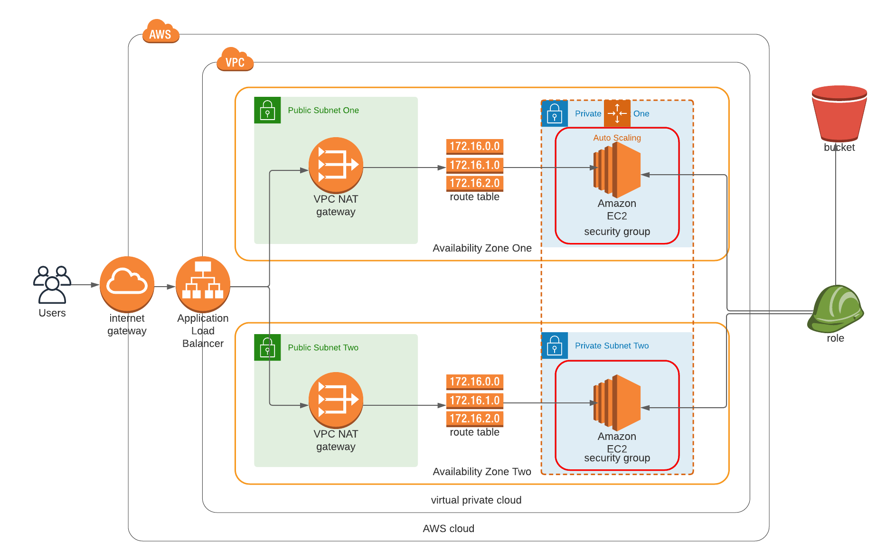

# Deploy a high-availability web app using CloudFormation
This project shows how to deploy web servers for a highly available web app using CloudFormation. The scripts create the network from scratch and deploy the virtual machines used to expose the application code present in an S3 Bucket.

## Description
The Launch Configuration deploys four servers, two located in each of private subnets. The launch configuration is used by an auto-scaling group. The Operating System's AMI used is Ubuntu 18 with two vCPUs, 4GB of RAM and 10GB of disk space. An IAM ROLE has been created to allow the instances to use the S3 Service. The application was deployed into private subnets with a Load Balancer located in a public subnet.

## Cloud Architecture Diagram

## How to launch the scripts
1. To deploy the network infrastructure it is necessary to run the follow bash script from the project folder: `./create.sh network network.yml network.json`
2. After the first point is successfully performed, run the second script to deploy the servers: `./create.sh servers servers.yml servers.json`
3. To delete all stacks launch first `./delete.sh network` and after the network is deleted launch `./delete.sh servers`
